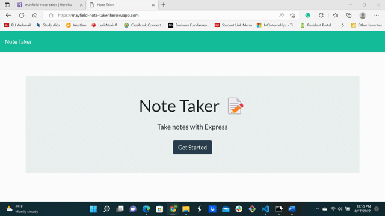

# Mayfield-Note-Taker

This repo houses the code used to build the Mayfield Note Taker, available at https://mayfield-note-taker.herokuapp.com/ .

## The Website

The Mayfield Note Taker provides a platform for users to take and store notes. Notes are saved to a remote server hosted by Heroku.

## Tools

* The website and server were built and developed using Visual Studio Code (VS Code). 
* HTML was used to create a webpage content.
* CSS was used to style the webpage content.
* Javascript was used to develop all frontend functionality.
* Express.js was used to create a server and handle requests from the frontend website to the backend server.
* Github hosts the repository for the website.
* Heroku hosts the server and deployed site

## Installation

* Access deployed app remotely at https://mayfield-note-taker.herokuapp.com/ .
* Access deployed app locally downloading code, initializing npm (__npm i__), and running npm start before accessing localhost:3001 in the browser.

## Credits

Made with ❤️ by Melissa Mayfield